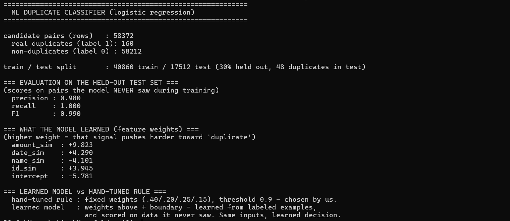
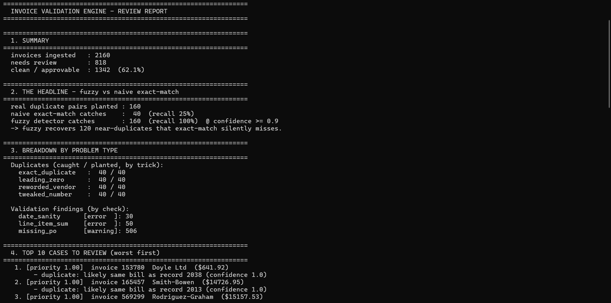
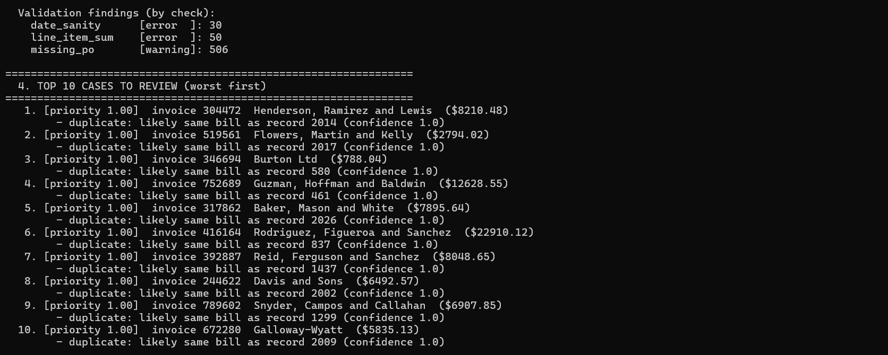

# Invoice Validation Engine - Fuzzy Duplicate Detection

Catch problem invoices *before* they get paid - especially the **near-duplicate
invoices** that standard exact-match ERP checks silently miss.

On a controlled dataset of 2,160 invoices with 160 planted duplicates:

| Detector | Duplicates caught | Recall |
|---|---|---|
| Naive exact-match (what ERPs ship with) | 40 / 160 | 25% |
| **This engine (fuzzy / similarity-based)** | **160 / 160** | **100%** |

The fuzzy layer recovers **120 near-duplicates that exact-match never sees** - at
zero false positives on this dataset.

---

## Why I built this

I worked on Oracle Integration Cloud (OIC) pipelines moving AP/AR/GL data into
Oracle ERP for an enterprise client. It was a relatively short engagement, so I
sat *one step downstream* of the data-quality problem - moving data between
systems - without personally living the pain AP teams face every day.

I wanted to build an ERP-related project to deepen that exposure, so I went
looking for the problems people who actually live in these systems struggle with.
One kept surfacing in AP forums and audit reports: **duplicate invoices.**

Big ERP systems (SAP, Oracle) *do* have duplicate-invoice checks - but they are
**exact-match**. They get beaten by trivial tricks:

- a leading zero added to the invoice number (`00123` vs `123`),
- a slightly reworded vendor name (`Acme Corp` vs `ACME Corporation Ltd`),
- the same bill resubmitted with a tweaked number or different formatting,
- the same supplier set up under two profiles.

A federal forensic audit documented a vendor splitting one invoice into two
submissions - one with a `00` prefix, one without - to slip past Oracle's
duplicate check. It is a real, documented gap that exact-match logic cannot close.

This project is the **similarity / record-linkage layer that closes it**: it scores
how likely two invoices are the same bill, even when someone has nudged the fields
to dodge an exact-match check. It is also built as the **feature layer for a
machine-learning model** - the per-field similarity scores are ML features and the
ground-truth answer key is labels, so a trained classifier drops straight on top
(see [Machine learning](#machine-learning)).

---

## How it works

The pipeline runs in stages, each a self-contained module:

```
generate  ->  ingest + clean  ->  validate  ->  detect duplicates  ->  rank  ->  report
(synthetic    (typed load,        (integrity   (the centerpiece:      (review   (CLI
 invoices +    normalize names,     checks)      similarity scoring)    queue)    report)
 a planted     store in SQLite)
 answer key)
```

### The duplicate detector (the centerpiece)

1. **Blocking.** Comparing every invoice against every other is ~2.3M
   comparisons here (and trillions at real scale). So we *block*: only compare
   invoices that share a `party_id`. This is the standard record-linkage move -
   it cuts the work ~40x with no loss of true pairs (a fraudster changing the
   vendor ID needs a whole second vendor profile, a different problem).

2. **Per-field similarity (a hybrid).** Different fields are forged differently,
   so each gets the metric that fits:
   - `invoice_id` -> **character edit-distance** (catches `00123` vs `123`, one
     flipped digit, an appended suffix).
   - `vendor name` -> **token-set overlap** (catches reordered / added words like
     `Acme Corp` vs `ACME Corporation Ltd`).

   Both come from one library (`rapidfuzz`), so the hybrid costs no extra
   dependency.

3. **Blend into one confidence.** Four signals - invoice number, vendor name,
   amount (exact match), and date proximity - combine via a weighted average into
   a single `confidence` in `[0, 1]`. No single field catches every trick; the
   blend sees the whole picture.

4. **Grade honestly.** Because the synthetic data ships with a ground-truth
   answer key, we measure **precision and recall** across confidence thresholds
   and pick the operating point. On this data, precision and recall are both
   1.0 across a wide band (0.70-0.90); we use **0.90** (the most conservative cut
   that still catches everything).

> **Honest caveat:** 100% precision/recall is on synthetic data *I designed* -
> it proves the mechanism works and quantifies the gap vs exact-match. It is not
> a claim of perfection on real data. The threshold *sweep* (not a hard-coded
> cutoff) is the defensible artifact: it shows the safe operating band, which on
> messier real data would narrow.

### The output

A ranked **review queue**: one row per flagged invoice, worst first, each with
plain-English reasons ("duplicate: likely same bill as record 2034" /
"missing_po: cannot three-way match"). Invoices with no problems are marked
auto-approvable, so a human only reviews the minority that need it (here, 38%).

---

## Machine learning

Two layers, kept honest:

- **The detector** is a similarity / record-linkage engine - it blends per-field
  similarity scores into one confidence, with weights chosen by analysis.
- **On top of it**, an optional **trained logistic-regression classifier**
  *learns* the weights and decision boundary from labeled examples and is
  evaluated on a held-out test set. The four similarity signals are its features;
  the ground-truth answer key is its labels.

```bash
python -m invoice_engine.ml.run     # train + evaluate the model (optional)
```

On a held-out test set the model reaches precision 0.98 / recall 1.00, and learns
for itself which signals matter most (it weights exact amount-match highest):



The core pipeline runs fully **without** this layer. Full explanation, including
what the model learns and why: **[docs/ML.md](docs/ML.md)**.

---

## Tech stack

| Choice | Why |
|---|---|
| **Python** | The ML / similarity / data-cleaning ecosystem lives here. |
| **polars** | Columnar + multithreaded; scales to realistic volumes and trains the modern (Spark/DuckDB-style) way of thinking. |
| **SQLite** | Single-file relational DB, real SQL, no server - mirrors the relational AP/ERP world while keeping the repo clone-and-run. |
| **rapidfuzz** | Fast, well-tested fuzzy string similarity for the hybrid metrics. |
| **CLI report** | Fast to build and demo; keeps focus on the data/ML core. |

Two data-modeling choices that matter in AP: `invoice_id` is stored as **TEXT**
(so `00123` is not silently turned into `123` - that *is* the signal we catch),
and money is handled as **exact Decimal** (never float) so integrity checks stay
trustworthy.

---

## Project layout (one line per file)

```
invoice_engine/
+-- generator/        # Stage 1: build the synthetic dataset
|   +-- config.py     # One settings dataclass: volume, seed, how many of each problem to plant.
|   +-- pool.py       # Builds the fixed pool of ~40 recurring vendors/customers.
|   +-- core.py       # Generates clean, valid invoices (lines that sum, sane dates).
|   +-- messiness.py  # Plants the problems (duplicates + integrity errors) + writes the answer key.
|   +-- generate.py   # Entry point: chains the above and writes raw CSVs.
|
+-- ingestion/        # Stage 2: load raw data into the database
|   +-- load.py       # Reads CSVs with FORCED types (so leading zeros / decimals survive).
|   +-- store.py      # Writes the cleaned frames into SQLite (money/dates as exact text).
|   +-- build.py      # Entry point: read -> clean -> store, then verify it survived.
|
+-- cleaning/
|   +-- normalize.py  # Adds a normalized vendor-name column (lowercased, suffixes stripped) for matching.
|
+-- validation/       # Stage 3: is each invoice internally valid?
|   +-- load.py       # Reads the DB back into typed frames (text -> Decimal/Date).
|   +-- checks.py     # The integrity checks: line-item sum, required fields, date sanity, missing PO.
|   +-- run.py        # Entry point: run all checks, store findings, sanity-check vs the answer key.
|
+-- duplicates/       # Stage 4: the centerpiece - find near-duplicate invoices
|   +-- similarity.py # The two hybrid metrics (edit-distance for id, token-set for name).
|   +-- blocking.py   # Narrows 2.3M possible pairs to candidates by party_id (~40x cut).
|   +-- score.py      # Blends 4 per-field signals into one confidence score per pair.
|   +-- grade.py      # Precision/recall vs the answer key + the naive exact-match baseline.
|   +-- persist.py    # Writes pairs above the threshold to the duplicate_findings table.
|   +-- run.py        # Entry point: detect + grade + show the fuzzy-vs-exact-match proof.
|
+-- scoring/          # Stage 5: rank everything for a human
|   +-- queue.py      # Merges validation + duplicate findings into one ranked row-per-invoice.
|   +-- run.py        # Entry point: detect -> persist -> build queue -> print the split.
|
+-- reporting/        # Stage 6: the human-facing view
|   +-- report.py     # Renders the sectioned CLI report (summary, headline, breakdown, top cases).
|   +-- run.py        # Entry point with flags: --all (full dump), --csv (export), --top N.
|
+-- ml/               # Optional: train an ML model on the similarity features
    +-- dataset.py    # Builds the (features, labels) table from scored pairs + answer key.
    +-- model.py      # Train/test split, logistic regression, held-out evaluation.
    +-- run.py        # Entry point: train + report precision/recall + learned weights.
```

---

## Quickstart

Requires Python 3.11+ and the packages in `requirements.txt`.

```bash
python -m venv .venv && pip install -r requirements.txt   # macOS/Linux
```

Run the pipeline in order, then read the report:

```bash
python -m invoice_engine.generator.generate    # 1. build the synthetic dataset
python -m invoice_engine.ingestion.build        # 2. load + clean into SQLite
python -m invoice_engine.validation.run         # 3. integrity checks
python -m invoice_engine.scoring.run            # 4. detect duplicates + build the queue
python -m invoice_engine.reporting.run          # 5. the report
```

To see the report again later, just run the last command. Full setup, all report
options (`--top`, `--all`, `--csv`), the optional ML step, and Windows notes are
in **[docs/RUNNING.md](docs/RUNNING.md)**.

> **Run it on your own ERP invoices** (Oracle / SAP exports) instead of the
> synthetic data - column mapping and steps in
> **[docs/USE_YOUR_OWN_DATA.md](docs/USE_YOUR_OWN_DATA.md)**.

---

## Screenshots

> Sample CLI output from `python -m invoice_engine.reporting.run`.
> (Place your images in a `docs/` folder and update the paths below.)

**Summary + the headline (fuzzy vs naive exact-match):**



**Breakdown by problem type and the top cases to review:**



---

## Design for real data, and what's next

The synthetic generator exists so the messiness is *controllable* and gradable
(every planted problem is recorded in an answer key). The ingestion layer is its
own module, so a **real public invoice dataset** can be swapped in without
touching the detector.

Deliberately scoped out of v1 (candidates for v2):

- Real OCR / PDF extraction (this engine assumes structured input). A future
  extraction layer would read invoice images into the **same unified schema**, so
  cleaning / validation / duplicate-detection stay unchanged - that is exactly
  why ingestion is its own module.
- A fuzzy-*name* blocking pass to also catch "same vendor under two profiles".
- A Postgres backend (e.g. with `pg_trgm`) - the ingestion seam keeps this isolated.
- GL reconciliation, multi-currency conversion, and a web dashboard.
```
